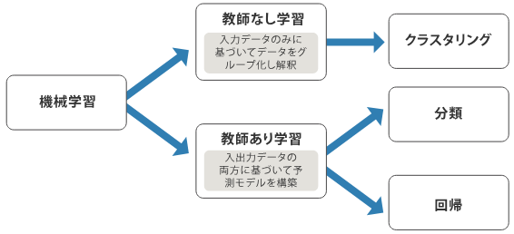
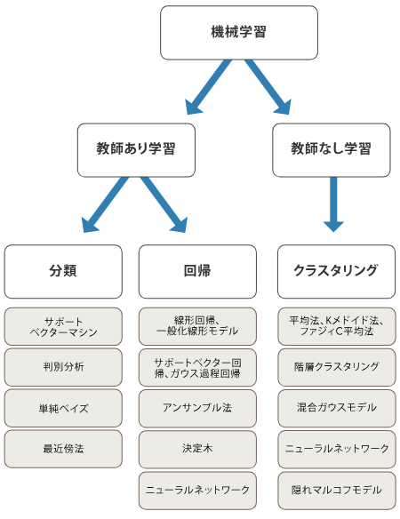

## 1.機械学習とは
```
コンピュータが学習して予想や判断を行うための記述です。
データから規則性を抽出し、その規則性を基に新たなデータに対する予測や分析を行うための手法です。
```

## 2.機械学習でできる事
- 予測： 過去のデータを利用して未来の結果を予測します。会社の売上予測や天気予報などがこれに当たります。
- 画像認識：　カメラからの入力を解析して特定のオブジェクトや人物を識別します。
- レコメンドシステム：　ユーザーの過去の行動や好みを学習し、ユーザに対して個別の商品やコンテンツを推薦します。

## 3.機械学習の得意不得意
- 得意な事
  - 大量なデータ処理：大量のデータを高速に処理し、パターン抽出。
  - 高次元のパターン検出：多次元のデータからも複雑なパターンを抽出が可能。
  - 客観的な判断：学習データとアルゴリズムに基づいて決定を下すために一貫した判断が可能
- 不得意な事
  - 創造性が必要な作業：作曲や描画・執筆などを行うAIも登場はしていますが、あくまでもそれらは過去のデータから最適なものを組み合わせて作っているだけで、人間のアーティストが行っているようなゼロから何かを生み出すという作業とは異なります。
  - 少ないデータの推論：学習に利用できるデータが少なければ、それに伴い精度も下がってしまいます。そのため、個人に合わせて対応を変えるパーソナライズ化なども、学習に利用できる個別のデータが少なく正確な判断ができないため、AIにとっては苦手なことに含まれます。
  - 目的を示す：AIは人間の脳のような処理が可能だと言っても、あくまでも人間側の設定した目的を達成するための最適な手段を示すだけで、目的そのものを自ら設定して示すことはできません。
  - 入力デバイスの性能を超える作業：AIは、カメラやマイクなどの入力デバイスの性能を超える作業をすることもできません。撮影場所が暗所や逆光の場合、カメラの性能によっては対象物がはっきりと撮影できないため、どれだけAIの性能が高くても対象物を検出することはできません。

## 4.機械学習で行う際の手順
- 1.ビジネス課題分析
  - 解決したい課題は何か？
  - 予測したい値は何か？
  - アクションプランは何か？
  - 使えるデータまたは特徴量は何か？
- 2.データ収集
  - データ観察
- 3.前処理
  - 欠損値の処理
  - データのスケーリング（特徴量において値を一定のルールに基づいて一定の範囲に変換する処理）
  - カテゴリカル変数のエンコーディング
  - 他のテーブルとの結合
- 4.モデルの学習
    - 回帰分析
    - ロジステック回帰
    - 決定木
    - ランダムフォレスト
- 5.モデルの評価
  - [機械学習で使われる評価関数まとめ](https://qiita.com/monda00/items/a2ee8e0da51953c24da8)

## 5.「教師あり学習」と「教師なし学習」
- 教師あり学習：与えられたデータを基に、与えられた変数（説明変数）に対して予測したい変数(目的変数)を求めるモデルを構築する手法です。
  - 例えば、スパムメールの判定や天気予報など過去のデータから判定します。
- 教師なし学習：目的変数がなく与えられた変数（説明変数）に注目した学習で、データに潜むパターンや示唆を見出そうとするもの。
  - 多数のデータをいくつかの類似のグループに分けるクラスタリング手法。




## 6.機械学習アルゴリズムについて
- 機械学習には様々な手法があり、適切な機械学習のアルゴリズムを選択する必要があります
- どの分析手法を選択するかは解決したい課題やデータや使用する変数によって決定します。
- 適切なアルゴリズムを探すには、試行錯誤に頼らざるを得ない部分があり、経験が必要な領域でもあります。
  


## 7.モデルの評価
- 作成した予測モデルの精度を数値的に評価します。
- 評価指標の種類は以下の通りになります。
```
正解率(Accuracy)
適合率(Precision)
再現率(Recall)
F値(F1-score)
MAE
MSE
RMSE
関係係数(寄与率)
```

- 分類モデル（項目をカテゴリ分けする際などに使われるモデル）には正解率・適合率・再現率・F値が用いられます。
- 回帰モデル（値を予測するために使われるモデル）にはMAE・MSE・RMSE・決定係数が用いられます。