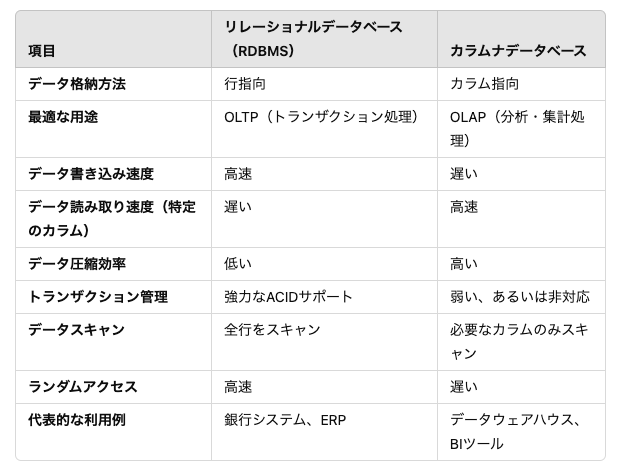

# BigQueryとは

## リレーションデータベース(行方向視点)
- 特徴
  - データはテーブル形式で行ごとに格納されます。
  - 一括書き込みやトランザクションの処理が効率的
  - 多くのトランザクション処理やCRUD（作成、読み取り、更新、削除）操作を頻繁に行う環境に向いている。
- 利点
  - 多くの業務システムやアプリケーションで使用されいる。
  - ACID（Atomicity, Consistency, Isolation, Durability）特性を提供し、データの一貫性が保たれます
- 欠点
  - すべての行から該当カラムを抽出するため、パフォーマンスが低下することがあります。
  - 行全体を読み込むため、必要ないデータも読み込むことが多くなり、大規模データの分析には不向きです。


## カラムナデータベース（列方向視点）
- 特徴
  - カラム指向（Column-Oriented）なデータ格納
  - カラム単位でデータが格納されるため、分析処理や集計クエリに適しています。
  - 分析や大規模データの集計処理に向いています（OLAP：Online Analytical Processing）。
- 利点
  - 必要なカラムのみを読み込むため、大規模データセットに対するクエリが高速に処理されます。
  - データ圧縮が容易
  - データのスキャンが効率的
- 欠点
  - 書き込み処理が遅い
  - トランザクション処理が弱い
  - ランダムアクセスに不向き



## BigQueryについて
- Google Cloud Platformで提供されているデータ分析プロダクトです。
- ビッグデータを高速で解析できるサービスで、1000テラバイト（1ペタバイト）を超える膨大なデータに及ぶ大量のデータを数十秒で処理が可能。
- データサイエンス分野で需要が高まり、高速で解析処理が実行できる必須のツールとなっている。
- BigQueryは99.99%の稼働時間を保証しています。
- BigQueryが超高速でデータ処理ができるのは、2つの仕組みがあるからです。一つはカラム型データストア、もう一つがツリーアーキテクチャです。
- ツリーアーキテクチャ：一つのクエリがツリーのように大きく広がり同時並行で分散処理されるので、膨大なデータが対象であっても超高速での処理が可能になっています。
- メリット
  - 高速にデータ処理できる
  - サーバーレスでビックデータを扱える
  - SQL操作が可能
  - GA4などのGoogleの他のプロダクトとの連携が容易


# BigQueryの使い方

```text
データセット ID
bigquery-public-data.ga4_obfuscated_sample_ecommerce

作成
2021/08/11, 7:27:49 UTC+9

デフォルトのテーブルの有効期限
なし

最終更新
2022/09/20, 16:43:30 UTC+9

データのロケーション
US

説明
Obfuscated Google Analytics 4 data emulating a web ecommerce implementation of Google Analytics. It’s a great way to look at business data and experiment and learn the benefits of analyzing Google Analytics data in BigQuery. Learn more at: https://developers.google.com/analytics/bigquery/web-ecommerce-demo-dataset

デフォルトの照合

デフォルトの丸めモード
ROUNDING_MODE_UNSPECIFIED

大文字 / 小文字の区別なし
false

ラベル

```

```sql
select
  distinct event_date
from
  `bigquery-public-data.ga4_obfuscated_sample_ecommerce.events_2021013*`
```
# GA4データのスキーマについて
|Type|Mode| |
|:----|:----|:----|
|event_date|STRING|NULLABLE|
|event_timestamp|INTEGER|NULLABLE|
|event_name|STRING|NULLABLE|
|event_params|RECORD|REPEATED|
|event_previous_timestamp|INTEGER|NULLABLE|
|event_value_in_usd|FLOAT|NULLABLE|
|event_bundle_sequence_id|INTEGER|NULLABLE|
|event_server_timestamp_offset|INTEGER|NULLABLE|
|user_id|STRING|NULLABLE|
|user_pseudo_id|STRING|NULLABLE|
|privacy_info|RECORD|NULLABLE|
|user_properties|RECORD|REPEATED|
|user_first_touch_timestamp|INTEGER|NULLABLE|
|user_ltv|RECORD|NULLABLE|
|device|RECORD|NULLABLE|
|geo|RECORD|NULLABLE|
|app_info|RECORD|NULLABLE|
|traffic_source|RECORD|NULLABLE|
|stream_id|INTEGER|NULLABLE|
|platform|STRING|NULLABLE|
|event_dimensions|RECORD|NULLABLE|
|ecommerce|RECORD|NULLABLE|
|items|RECORD|REPEATED|

```sql
-- 作成先のDBとテーブル名を記載
create or replace table `[サーバー名].sandbox.access_log_ga4` as

-- 実行内容 
with session_id_tb as (
  select
    event_date,
    event_name,
    user_pseudo_id,
    (SELECT value.int_value FROM UNNEST(event_params) WHERE key = 'ga_session_id') AS ga_session_id,
  from
    `bigquery-public-data.ga4_obfuscated_sample_ecommerce.events_202101*`
)
select
  user_pseudo_id,
  count(distinct concat(user_pseudo_id, ga_session_id)) as session_num,
  countif(event_name = 'page_view') as pv_num,
  countif(event_name = 'purchase') as purchase_num
from
  session_id_tb
group by user_pseudo_id
order by session_num desc, pv_num desc
```


## urlとbrwserを追加
```sql
create or replace table `[db].sandbox.access_log_ga4_sample2` as

WITH session_id_tb AS (
  SELECT
    event_date,
    event_name,
    user_pseudo_id,
    (SELECT value.int_value FROM UNNEST(event_params) WHERE key = 'ga_session_id') AS ga_session_id,
    (SELECT value.string_value FROM UNNEST(event_params) WHERE key = 'page_location') AS page_location-- URLを取得
  FROM
    `bigquery-public-data.ga4_obfuscated_sample_ecommerce.events_202101*`
)
SELECT
  page_location, -- URL
  user_pseudo_id, -- ユーザーID
  COUNT(DISTINCT CONCAT(user_pseudo_id, ga_session_id)) AS session_num, -- セッション数
  COUNTIF(event_name = 'page_view') AS pv_num, -- ページビュー数
  COUNTIF(event_name = 'purchase') AS purchase_num -- 購入数
FROM
  session_id_tb
WHERE
  page_location IS NOT NULL -- URLが存在するイベントのみ対象
GROUP BY
  page_location, user_pseudo_id -- URL、ユーザー、ブラウザごとに集計
ORDER BY
  session_num DESC,
  pv_num DESC;


```

