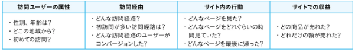
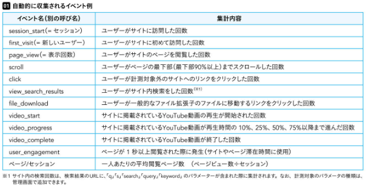
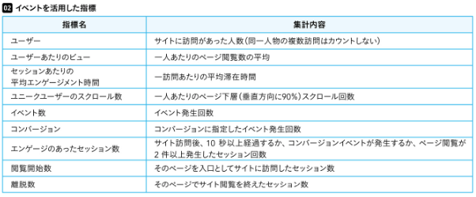
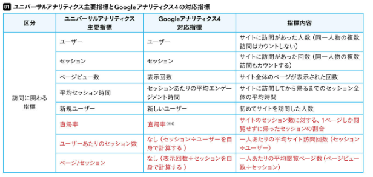
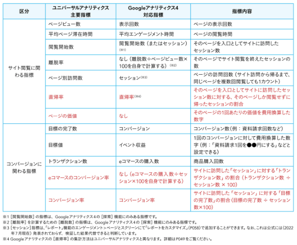
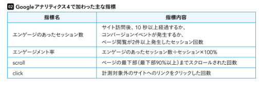
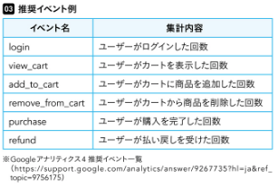

# GA4とは
```txt
GA4（Googleアナリティクス 4）とは、ウェブサイトへ訪問したユーザーの行動を分析するアクセス解析ツールです。 Googleアナリティクス4を自社サイトに導入することで、サイト内でのユーザーの行動だけでなく、自社の商品やサービスに興味を持っている年齢層や性別まで把握できます。
```

## GA4で分析できる領域
```txt
訪問ユーザーの属性：アクセス地域、性別、年齢など
訪問経由：サイトへの訪問経路
サイト内の行動：サイト内の閲覧ページを調べる
サイトでの収益：サイトでの売上
```


## 自動的に収集されるイベント


## イベントを活用した指標








## あらかじめ設定が必要な推奨イベント


