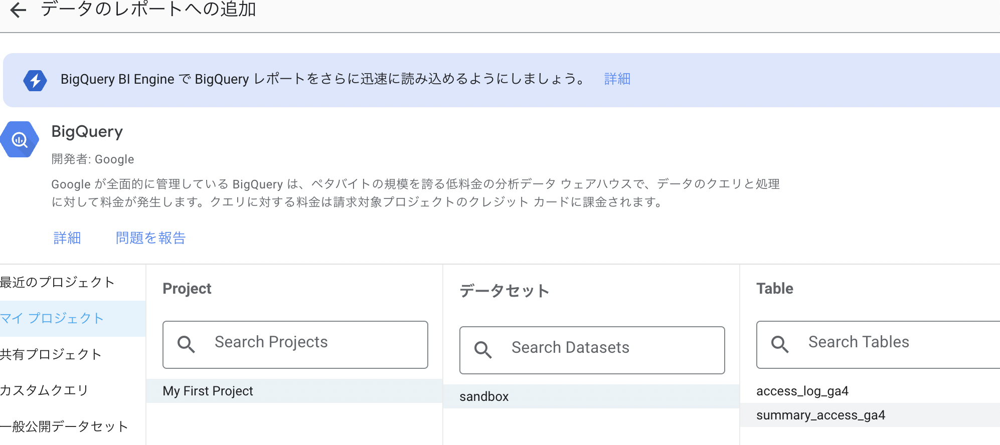

## LookerStudioで基本的な指標を可視化 

#### テーブルの作成
```sql
create or replace table `[サーバー名].sandbox.summary_access_ga4` as

with access_tb as (
  select
    event_date,
    event_name,
    user_pseudo_id,
    (SELECT value.int_value FROM UNNEST(event_params) WHERE key = 'ga_session_id') AS ga_session_id,
  from
    `bigquery-public-data.ga4_obfuscated_sample_ecommerce.events_202101*`
)

select
  event_date,
  count(distinct user_pseudo_id) as uu_num,
  count(distinct concat(user_pseudo_id, ga_session_id)) as session_num,
  countif(event_name = 'page_view') as pv_num
from
  access_tb
group by event_date
order by event_date
```

## Looker Sturdio

#### レポート作成からBigQueryの読み込み


#### レポートリンク
https://lookerstudio.google.com/reporting/21454a81-dd7e-4581-ae55-1c2089fb5f25

#### コード埋め込み例
```html
<iframe width="600" height="450" src="https://lookerstudio.google.com/embed/reporting/21454a81-dd7e-4581-ae55-1c2089fb5f25/page/AYQCE" frameborder="0" style="border:0" allowfullscreen sandbox="allow-storage-access-by-user-activation allow-scripts allow-same-origin allow-popups allow-popups-to-escape-sandbox"></iframe>
```